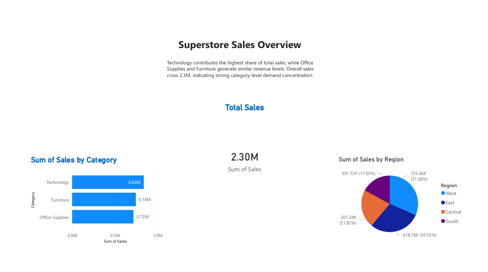
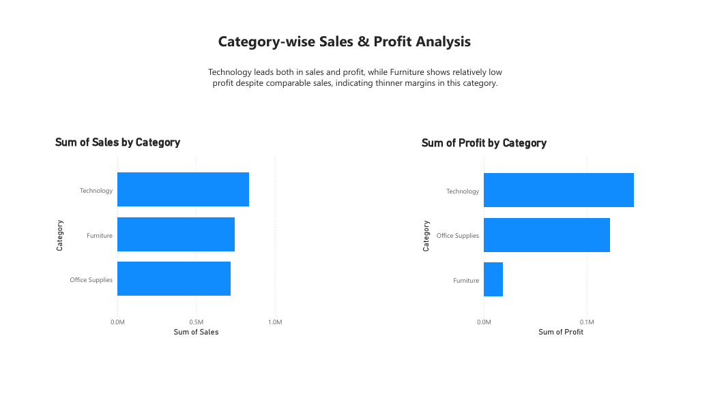
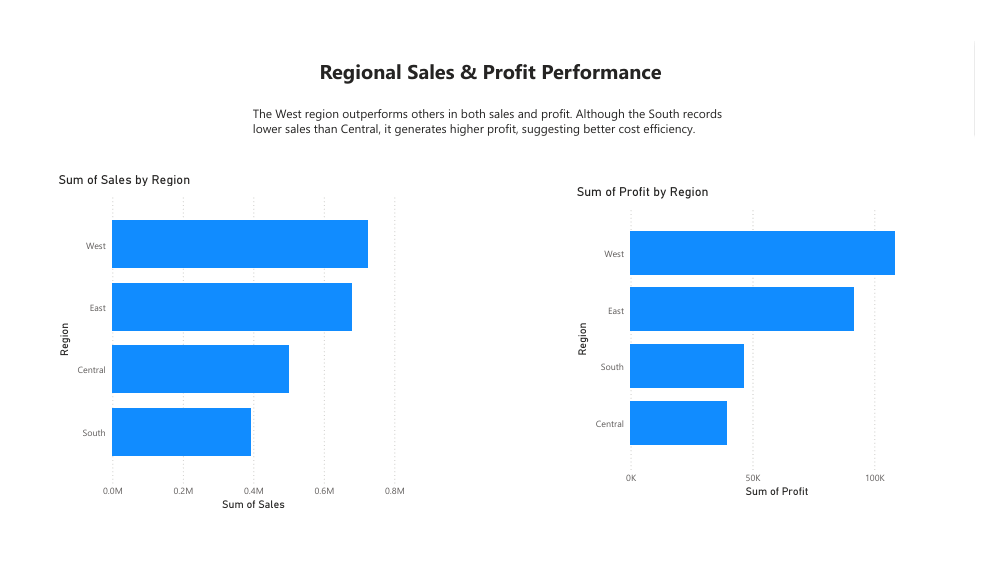

# Superstore Sales Analysis (Power BI)

## Project Overview
**Total Sales Analyzed**: $2.3M+ across categories and regions
This project analyzes sales and profit performance of a retail superstore using Power BI.
The goal was to identify category-level trends, regional performance, and profitability insights
to support data-driven business decisions.

## Dashboard Preview

### Sales Overview

### Category Analysis

### Regional Performance

## Key Insights
- Total sales exceed $2.3M across all categories.
- Technology contributes the highest share of sales and profit.
- Furniture shows lower profit despite comparable sales, indicating thinner margins.
- West region outperforms others in both sales and profit.
- South region is more cost-efficient than Central despite lower sales.

## Tools Used
- Power BI Desktop

## Files Included
- Power BI `.pbix` report file
- PDF export of dashboard
- Dashboard screenshots for quick preview

## Author
Aditi Thakur
